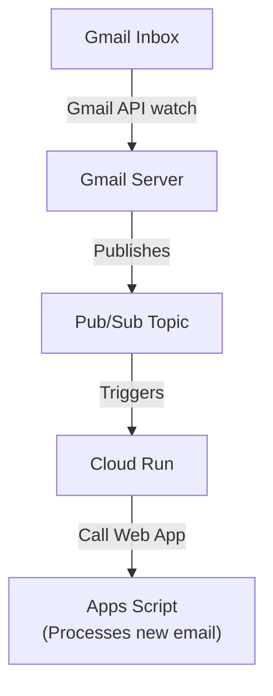

# **Realtime Gmail Listener with Cloud Run and Apps Script**

This project provides a **realtime, serverless solution** to monitor Gmail for new messages using **push notifications** instead of traditional polling. It leverages **Google Cloud Pub/Sub** to receive events instantly when a new email arrives, and routes them through **Cloud Run** to **Apps Script**, where your custom processing logic (e.g., updating Google Sheets) runs.

Many Gmail integrations rely on **polling** (e.g., every 5–10 minutes) to check for new emails.
This approach not only introduces **delay**, but also **exhausts Apps Script’s daily quota**—specifically the **“Triggers total runtime” limit**, which is capped at **90 minutes per day** for consumer accounts. Even moderate polling usage can hit this limit quickly, leading to silent failures or missed updates.

This project avoids polling entirely and achieves **instant responsiveness** using Gmail’s `watch()` API with Pub/Sub and Cloud Run.

### 🔧 Key Components

* **Gmail API** – Watches for new messages and sends push notifications.
* **Pub/Sub** – Receives events and buffers them reliably.
* **Cloud Run** – Acts as a webhook endpoint to receive Pub/Sub pushes and forward to Apps Script.
* **Apps Script** – Handles the business logic (e.g., parsing emails, writing to Sheets).
* **SheetLayout Class** – Manages dynamic spreadsheet layouts.
* **Secret Manager** – Stores sensitive configuration (tokens, script URLs, etc.) securely.

This setup offers a **scalable, secure, and truly real-time** email listener inside the Google ecosystem.

---

## ✨ Features

* **📬 Realtime Email Notifications**
  Listens for new Gmail messages using the Gmail `watch()` API and Pub/Sub, avoiding delay from polling.

* **⚡ Serverless & Scalable**
  Built entirely with Google Cloud services (Cloud Run, Pub/Sub, Secret Manager, Apps Script), requiring zero server maintenance.

* **🔐 Secure Secret Management**
  API URLs and keys are stored in Secret Manager and injected securely at runtime—no hardcoded secrets.

* **🔁 Automatic Watch Renewal**
  Time-based Apps Script triggers automatically renew Gmail watch subscriptions before expiration.

* **📄 Smart Spreadsheet Layout**
  Uses the `SheetLayout` class to dynamically manage sheet headers and structure—reducing code duplication.

* **🧪 Clean Resource Management**
  Includes deployment and teardown scripts for easy setup and full cleanup.

* **🧩 Modular Design**
  Clear separation of concerns: Cloud Run handles the webhook, Apps Script processes logic, and scripts automate the setup.

* **✅ No Polling Required**
  Entirely event-driven—avoids exceeding Apps Script's time-based trigger quotas and ensures higher reliability.

---

## 🧭 Workflow



---

## 🚀 Usage

### 📥 Start Listening

From the spreadsheet’s **Custom Menu**, choose **Start listening**. This will:

* Send a `watch()` command to the Gmail API to start pushing notifications to the configured Pub/Sub topic.
* Schedule a time-driven trigger to re-initiate the `watch()` **1 hour before expiration** (Gmail watches expire after 7 days).

### 🛑 Stop Listening

Choose **Stop listening** from the custom menu. This will:

* Call the Gmail API to **stop** the current `watch()`.
* **Delete the scheduled trigger** associated with the listener.

---

## 📁 Project Structure

```
/src
│── cloud_run/
│   ├── index.js              # Cloud Run webhook handler
│   └── package.json
│
│── apps_script/
│   ├── config.gs             # Sheet configuration and constants
│   ├── triggers.gs           # Installable triggers for scheduling
│   ├── utils.gs              # Helper functions
│   ├── event-handlers.gs     # Gmail and Pub/Sub event processing
│   └── package.json
│
└── scripts/
    ├── config.ps1            # PowerShell setup for config and secrets
    ├── deploy-cloud-run.ps1  # Deploy Cloud Run service and supporting infra
    └── teardown-cloud-run.ps1# Full teardown of resources
```

---

## ⚙️ Apps Script Setup

Before deploying the backend infrastructure, you must first set up and deploy your Apps Script project:

### 1. Register Apps Script with a GCP Project

1. Open your Apps Script project.
2. Go to **Project Settings** → click **"Change project"** under Google Cloud Platform (GCP) Project.
3. Link it to a new or existing GCP project.
4. Enable the following APIs in the linked GCP project:
   - Gmail API – obviously
   - Cloud Build API – used to build and deploy containers
   - Artifact Registry API – used to store Docker images
   - Cloud Pub/Sub API – used to receive Gmail push notifications
   - Cloud Run API – used to deploy and manage the Cloud Run service
   - Eventarc API – used to create triggers from Pub/Sub to Cloud Run
   - Secret Manager API – used to securely store and access sensitive information

### 2. Enable Gmail API in Apps Script Services
1. In the Apps Script editor, click + Services (left sidebar).
2. Find and add Gmail API.
3. This enables Gmail.Users.watch() functionality within your script.

### 3. Deploy Apps Script as Web App

1. Click **Deploy** → **Manage deployments**
2. Choose **Web App** as the deployment type
3. Set:
   - **Execute as:** Me
   - **Who has access:** Anyone
4. Click **Deploy** and copy the **Web App URL**.
5. Set this value in Secret Manager as `PUSH_PROXY_GAS_API_URL`.

> 🔐 You must also set a custom API key in `config.gs`, and store it in Secret Manager as `PUSH_PROXY_GAS_API_KEY`.

---

## 🔧 Setup & Deployment

All of the setup and deployment steps are handled by the provided PowerShell script.

This includes:

* Pub/Sub topic setup
* Service account creation and role bindings
* Cloud Run deployment
* Eventarc trigger setup
* Permission bindings for Gmail and Cloud Run
* Secret Manager integration


### 🛠️ Before Running the Script

You must manually set up the following **Secret Manager entries**, as they contain sensitive data used during runtime:

#### Required Secrets:

| Secret Name              | Description                                                   |
| ------------------------ | ------------------------------------------------------------- |
| `PUSH_PROXY_GAS_API_URL` | The **Apps Script Web App URL** that Cloud Run will call      |
| `PUSH_PROXY_GAS_API_KEY` | The **API key** to authenticate requests (set in `config.gs`) |

#### To add these secrets:

```bash
gcloud secrets create PUSH_PROXY_GAS_API_URL --data-file=- <<< "https://script.google.com/macros/s/your-script-deployment-id/exec"
gcloud secrets create PUSH_PROXY_GAS_API_KEY --data-file=- <<< "your-secret-api-key"
```

> 🔐 Replace the placeholders with your actual values.


### ▶️ To deploy everything:

1. Open **PowerShell**.
2. Navigate to the project root directory.
3. Run:

```powershell
powershell -ExecutionPolicy ByPass -File "path\to\scripts\deploy-cloud-run.ps1"
```

> ⚠️ The `-ExecutionPolicy ByPass` flag is used to temporarily allow the script to run, even if your system's execution policy restricts unsigned scripts. This avoids permission errors without changing your system-wide settings.


### 🔍 What the deployment script does

```text
# --- 1. Artifact Registry Setup ---
# Creates Docker repository if not exists.

# --- 2. Pub/Sub Topic Setup ---
# Creates Pub/Sub topic and grants Gmail API permission to publish.

# --- 3. Service Account Setup ---
# Creates a dedicated service account and assigns necessary roles.

# --- 4. Cloud Run Service Deployment ---
# Builds Docker image, deploys Cloud Run, and assigns run.invoker role.

# --- 5. Eventarc Trigger Creation ---
# Connects Pub/Sub topic to Cloud Run with the correct trigger filter.
```

After deployment, the script will output the **Cloud Run URL**—which is automatically subscribed to Gmail push events and forwards them to your Apps Script Web App.

---

## 🧹 Teardown Instructions

To clean up all deployed resources, you can run the provided PowerShell script:

```powershell
powershell -ExecutionPolicy ByPass -File "path\to\scripts\teardown-cloud-run.ps1"
```

This script will reverse everything created during deployment.


### 🔽 What the teardown script does

```text
# --- 1. Delete Eventarc Trigger ---
# Removes the Eventarc trigger that connects the Pub/Sub topic to Cloud Run.

# --- 2. Delete Cloud Run Service ---
# Deletes the deployed service. The run.invoker IAM binding is deleted along with it.

# --- 3. Remove IAM Bindings from Project ---
# Cleans up project-level role bindings assigned to the service account.

# --- 4. Delete Service Account ---
# Deletes the custom service account created for this workflow.

# --- 5. Delete Pub/Sub Topic ---
# First removes the specific IAM policy binding for the Gmail service account,
# then deletes the topic.

# --- 6. Delete Artifact Registry Repository ---
# Removes the Docker image repository used for Cloud Run builds.

# --- 7. Delete GCS Bucket for Cloud Build Artifacts ---
# Deletes the temporary Cloud Build bucket created during deployment.
```

> ❗ **Note:** Secret Manager entries (`PUSH_PROXY_GAS_API_URL`, `PUSH_PROXY_GAS_API_KEY`) are **not deleted automatically**. You can delete them manually if no longer needed:

```bash
gcloud secrets delete PUSH_PROXY_GAS_API_URL
gcloud secrets delete PUSH_PROXY_GAS_API_KEY
```

---

## 🔐 Security Practices

This project follows several best practices to ensure secure handling of credentials, API keys, and execution environments:

### ✅ Secrets Are Never Hardcoded

* Sensitive data such as the Apps Script Web App URL and API key are stored in **Secret Manager**, not in source files.
* These secrets are injected into the Cloud Run service at deploy time using the --set-secrets flag, ensuring a clean separation between code and credentials.

### ✅ Principle of Least Privilege

* A **dedicated service account** is created specifically for this project.
* This service account is granted **only the required roles**, such as Pub/Sub Subscriber and Cloud Run Invoker, limiting the blast radius if compromised.

### ✅ No Public Exposure of Apps Script

* The Apps Script Web App is protected using a custom **API key**.
* Only Cloud Run (authorized via the API key) is allowed to call the Apps Script endpoint.

### ✅ Webhook Secured via API Key

* Cloud Run includes the API key in the request header when forwarding events to Apps Script.
* Apps Script validates the API key before processing any event.

### ✅ Cloud Run HTTPS-Only by Default

* Cloud Run only accepts **HTTPS traffic**.
* All webhook communications are **TLS-encrypted** end to end.

### ✅ Controlled Gmail Watch Access

* For consumer Gmail accounts, only the account that owns the Apps Script project can initiate or stop the Gmail `watch()` subscription.
* For Google Workspace accounts, the `watch()` is managed via the Gmail API using a service account with **domain-wide delegation**, so the account that initiates or stops the watch does not need to be the same account that owns the Apps Script project.
* Pub/Sub topics are configured to only accept messages from Gmail’s **verified service account** (`gmail-api-push@system.gserviceaccount.com`).

---

## 📌 Real-World Use Cases

This architecture supports a wide range of realtime Gmail-driven workflows. Here are some examples:

### ✅ Sample Use Case (in this project)

* **Log new emails into a Google Sheet**
  For every new email received, extract `datetime`, `from`, and `subject`, and append them as a new row in a tracking sheet.


### 📦 Additional Real-World Use Cases

* **📤 Auto-reply to Specific Senders**
  Trigger an automated, templated response (e.g., for job applications or support emails) based on sender address or subject keywords.

* **📅 Auto-create Calendar Events**
  Parse structured emails (e.g., booking confirmations, meeting invites) and auto-add them to Google Calendar with proper details.

* **📁 Label & Archive Emails Based on Rules**
  Automatically apply Gmail labels or move emails to folders based on predefined rules or spreadsheet configurations.

* **🚨 Alert & Escalation System**
  Forward emails from high-priority senders or subjects (e.g., “urgent”, “failure”, “downtime”) to Slack, Telegram, or SMS using webhooks.

* **📊 Real-time Dashboarding**
  Populate Google Sheets with incoming customer inquiries or orders for live dashboards and reporting.

* **🔄 Sync Gmail with External Systems**
  On each new email, push metadata to a CRM, ticketing system, or internal API to keep systems in sync.

* **🧹 Auto-cleanup of Inbox**
  Automatically delete or archive promotional/notification emails after recording them elsewhere (e.g., in a Sheet or database).

---

## ⚠️ Why Not Use Apps Script as a Webhook Endpoint?

Apps Script **cannot act as a webhook endpoint** for services like Pub/Sub due to how it handles URL redirects:

* Apps Script Web Apps are hosted at `script.google.com`, which **redirects** to `script.googleusercontent.com`.
* The original endpoint (`script.google.com`) returns **HTTP 302**, not **200 OK**.
* **Most webhook providers (Pub/Sub, FCM, etc.) do not follow redirects**, and treat this as a failure.
* The push itself **does go through successfully**, but since Pub/Sub doesn't receive a 200 OK, it **retries the push repeatedly**.

> 💡 A workaround can be made so that Pub/Sub only sends **one push and never retries**, but this makes the workflow **unreliable**—you’d lose guaranteed delivery in case of failures.

This redirect behavior is **intentional for security reasons**. Platforms like Zapier, GoHighLevel, etc., do follow redirects and can work with Apps Script endpoints, but for **Pub/Sub**, a proxy (such as **Cloud Run**) is required for reliable delivery.


## 💰 Cost Analysis

For typical usage—such as receiving **1,000 emails per day**—the cost is minimal and often stays within GCP’s free tier. Services like **Cloud Run**, **Pub/Sub**, **Eventarc**, and **Secret Manager** all have generous free quotas. Gmail push notifications are lightweight, so Pub/Sub and Eventarc costs remain near zero. Occasional Cloud Build usage for deployment and small artifact storage adds negligible cost.

In most cases, total monthly cost will be **under \$1–2 USD**, or even free if you remain within free tier limits.
